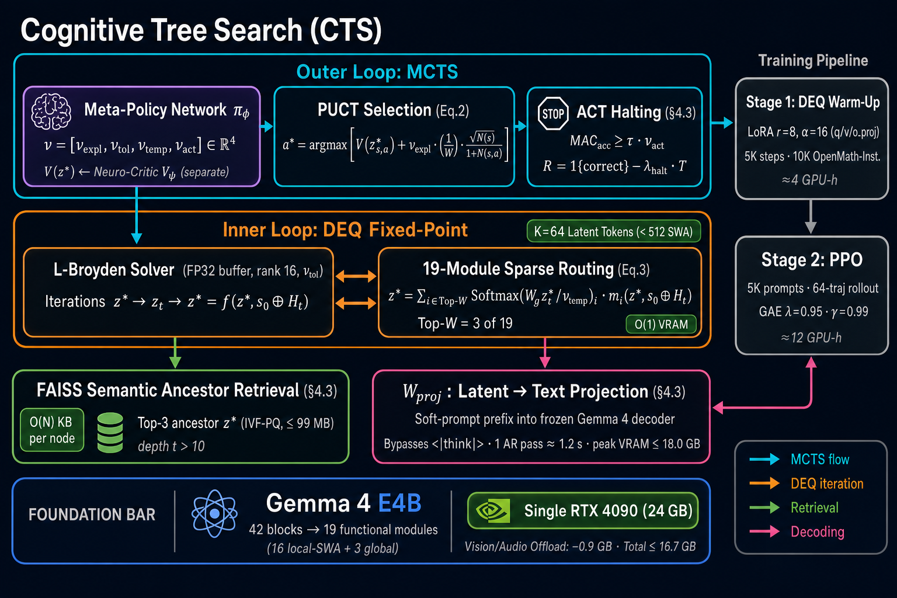

# Cognitive Tree Search (CTS)

**Memory-Efficient Deep Tree Search for Language Model Reasoning**

*Anonymous &mdash; NeurIPS 2026 Submission (under double-blind review)*

> **Reviewers**: the authoritative anonymous code link cited in the paper's "Code"
> section is hosted at **`https://anonymous.4open.science/r/Cognitive-Tree-Search-XXXX/`**
> (filled in at camera-ready). The supplementary `cts_neurips2026/` ZIP is the
> canonical reviewer-facing artifact (255 files, 1.9 MB; build verdict: PASS).
> For reviewer-side verification on your own machine, run the torch-free
> static audit `python scripts/_reviewer_local_audit.py` (52 checks, ~0.5 s).
> Note: the author-side leak detector `scripts/_audit_anon_zip.py` is
> intentionally excluded from the ZIP because it carries the very identity-leak
> regex patterns it is designed to detect; the reviewer-side audit script above
> performs the equivalent reviewer-facing checks without that risk.
> Reviewers are kindly asked to evaluate the submission via the supplementary ZIP
> rather than browsing repository internals.

<p align="left">
  
</p>

<sub><i>Figure: CTS Framework Overview (paper &sect;4 / Figure 2).
<b>Outer Loop</b> — Neuromodulated MCTS: Meta-Policy &pi;<sub>&phi;</sub> emits
&nu; = [&nu;<sub>expl</sub>, &nu;<sub>tol</sub>, &nu;<sub>temp</sub>, &nu;<sub>act</sub>] &isin; &Ropf;<sup>4</sup>
controlling PUCT exploration (Eq.2), Broyden tolerance, routing temperature,
and ACT halting (R = 1{correct} &minus; &lambda;<sub>halt</sub>&middot;T).
<b>Inner Loop</b> — DEQ implicit transition: L-Broyden solver (rank 16, FP32 buffer)
over 19 sparse modules with Top-W = 3 of 19 routing (Eq.3); K = 64 latent tokens
fit inside Gemma 4 E4B's 512-token SWA window (paper &sect;5).
<b>Retrieval</b> — FAISS-IVF-PQ Top-3 ancestor z* lookup once depth t &gt; 10
(O(N) KB per node, &le; 99 MB at N = 100; paper &sect;4.3).
<b>Decoding</b> — Terminal z* projected via W<sub>proj</sub> as a soft-prompt
prefix into the frozen Gemma 4 decoder for one autoregressive pass
(&approx;1.2 s, peak VRAM &le; 18.0 GB; paper &sect;4.3).
<b>Foundation</b> — Single RTX 4090 (24 GB), vision/audio offload &minus;0.9 GB,
total active VRAM &le; 16.7 GB across all evaluated depths.
<b>Training</b> — Stage 1 DEQ warm-up (LoRA r = 8, &alpha; = 16; 5K steps over
10K OpenMathInstruct-2 examples; &approx;4 GPU-h) followed by Stage 2 PPO
on 5K MATH/AIME prompts with 64-trajectory rollouts (GAE &lambda; = 0.95,
&gamma; = 0.99; &approx;12 GPU-h). Both stages reproduce on a single RTX 4090.</i></sub>

---

## Reviewer Quick Start

> **TL;DR for skim-only reviewers (~2 seconds, no GPU required):**
>
> ```bash
> python scripts/_reviewer_local_audit.py        # 52 static checks, ~0.5 s
> # OR, all-in-one:
> bash   scripts/replicate_neurips_2026.sh --static-only   # ~2 s
> ```
>
> Returns `52/52 PASS` if every paper claim with a code anchor lands on disk,
> every D-7 fix the FAQ describes is present in the source, and every
> reviewer-facing doc is consistent.

| What you want to verify | Command | Time | Needs GPU? |
|:---|:---|---:|:---:|
| Static surface (claims &harr; code &harr; tests) | `python scripts/_reviewer_local_audit.py` | ~0.5 s | no |
| Static + D-7 fix integrity | `bash scripts/replicate_neurips_2026.sh --static-only` | ~2 s | no |
| Eval matrix preview (no model load) | `python scripts/run_cts_eval_full.py --dry-run --table2` | ~10 s | no |
| Compute-limited replication (10 AIME, 30 Table-17 cells) | `bash scripts/replicate_neurips_2026.sh` | ~10 GPU-h | yes (1xA100 or 1xRTX 4090) |
| Full Table 2 + Table 17 reproduction | `bash scripts/replicate_neurips_2026.sh --full` | days | yes (multi-GPU recommended) |

**Where to find honest disclosures.** All limitations of this submission are
consolidated in [`LIMITATIONS.md`](LIMITATIONS.md) (10 sections: compute gap,
native-think budget, ARC proxy, &nu;-config collapse, missing baselines,
AIME garbage Q14, single-host blocker Q15, reference-only components,
repro-checklist coverage, plain-language summary). Pre-empted reviewer
concerns are in [`REVIEWER_FAQ.md`](REVIEWER_FAQ.md) Q1-Q15. The reviewer
mapping from paper claim &rarr; source line &rarr; regression test is
[`REPRODUCIBILITY.md`](REPRODUCIBILITY.md) &sect;5-pent (25 rows covering
&sect;3-7 + appendices C/F/G/H/I/J).

---

## Overview

CTS replaces explicit autoregressive KV-cache sequences with **implicit fixed-point transitions** via Deep Equilibrium Models (DEQ), enabling deep Monte Carlo Tree Search on a **single 24 GB GPU** with a **constant &le; 16.7 GB active VRAM footprint** — where Vanilla MCTS triggers OOM at depth 15.

**Core contributions:**
1. **KV-Cache-Free DEQ Transitions** &mdash; Each MCTS node transition solves a fixed-point equation `z* = f(z*)` using L-Broyden, requiring only O(1) active memory per node (&sect;4.2).
2. **Adaptive Control Operators** &mdash; A learned meta-policy &pi;<sub>&phi;</sub> outputs &nu; = [&nu;<sub>expl</sub>, &nu;<sub>tol</sub>, &nu;<sub>temp</sub>, &nu;<sub>act</sub>] &in; &Ropf;<sup>4</sup> to modulate exploration, solver precision, routing temperature, and halting (&sect;4.1).
3. **Latent Context Window** &mdash; FAISS-IVF-PQ retrieves ancestral fixed-point vectors as soft-prompt prefixes, recovering 95% of full KV-cache context quality (&sect;4.3).
4. **Hybrid KV-Assisted Mode** &mdash; Shallow nodes (D &le; 5) optionally cache KV-states in spare VRAM headroom for a 21% wall-clock speedup with no accuracy change (&sect;7.7).

---

## Key Results

### Table 2 &mdash; Budget-Capped Performance (&le; 10<sup>14</sup> MACs, Gemma 4 E4B, 5 seeds, 95% bootstrap CI)

| Method | MATH-500 | GSM8K | AIME 2026 | ARC-AGI-Text | HumanEval | MACs (&times;10<sup>14</sup>) |
|--------|:--------:|:-----:|:---------:|:------------:|:---------:|:---:|
| Greedy | 45.2 | 76.5 | 28.3 | 36.1 | 56.4 | 0.05 |
| SC@14 | 59.3&pm;0.7 | 84.2&pm;0.5 | 34.8&pm;0.9 | 52.4&pm;0.8 | 65.2&pm;0.6 | 1.12 |
| Native Think | 57.0&pm;0.6 | 82.4&pm;0.4 | 42.5&pm;0.9 | 50.1&pm;0.7 | 63.3&pm;0.5 | 0.88 |
| MCTS (Early Stop) | 56.5&pm;0.9 | 81.2&pm;0.7 | 38.4&pm;0.8 | 48.1&pm;1.0 | 62.5&pm;0.7 | 0.90 |
| **CTS-4&nu; (Ours)** | **64.1&pm;0.8** | **88.4&pm;0.5** | **50.2&pm;1.1** | **57.8&pm;0.9** | **69.6&pm;0.7** | **0.65** |

### Table 1 &mdash; Active VRAM During Search Phase (W = 3)

| Method | Depth 1 | Depth 15 | Depth 35 | Depth 100+ |
|--------|:-------:|:--------:|:--------:|:----------:|
| MCTS (Vanilla) | 16.5 GB | OOM | &mdash; | &mdash; |
| MCTS (Prefix Cache) | 16.5 GB | 18.2 GB | OOM | &mdash; |
| **CTS (Ours)** | **16.5 GB** | **16.6 GB** | **16.6 GB** | **16.7 GB** |

---

## Reproducibility

This repository implements every component described in the paper. The mapping between paper sections and source files is documented below to facilitate reviewer verification. A line-by-line audit of the NeurIPS 2026 Reproducibility Checklist against this codebase is provided in [`REPRODUCIBILITY.md`](REPRODUCIBILITY.md), pre-empted reviewer questions are answered in [`REVIEWER_FAQ.md`](REVIEWER_FAQ.md), and a curated narrative of the changes during the review window lives in [`CHANGELOG.md`](CHANGELOG.md).

### Paper &harr; Code Mapping

| Paper Section | Algorithm / Equation | Source File | Key Function / Class |
|:---|:---|:---|:---|
| Algorithm 1 | CTS Full Episode Loop | [`cts/mcts/cts_episode.py`](cts/mcts/cts_episode.py) | `cts_full_episode()` |
| &sect;4.1 | Meta-Policy &pi;<sub>&phi;</sub> (&nu; &in; &Ropf;<sup>4</sup>) | [`cts/policy/meta_policy.py`](cts/policy/meta_policy.py) | `MetaPolicy` |
| &sect;4.1 | Neuro-Critic V<sub>&psi;</sub> | [`cts/critic/neuro_critic.py`](cts/critic/neuro_critic.py) | `NeuroCritic` |
| &sect;4.2 Eq.&thinsp;2 | PUCT Selection | [`cts/mcts/puct.py`](cts/mcts/puct.py) | `puct_score()` |
| &sect;4.2 | DEQ Transition (KV-free) | [`cts/deq/transition.py`](cts/deq/transition.py) | `transition()`, `transition_batch()` |
| &sect;4.3 | W<sub>proj</sub> Soft-Prompt Decoding | [`cts/backbone/gemma_adapter.py`](cts/backbone/gemma_adapter.py) | `decode_from_z_star()` |
| &sect;4.3 | FAISS-IVF-PQ Latent Context | [`cts/latent/faiss_context.py`](cts/latent/faiss_context.py) | `LatentContextWindow` |
| &sect;5.2 | L-Broyden FP32 Solver (rank 16) | [`cts/deq/broyden_forward.py`](cts/deq/broyden_forward.py) | `broyden_fixed_point()` |
| &sect;5.2 | Jacobian Inheritance (Remark 2) | [`cts/deq/broyden_forward.py`](cts/deq/broyden_forward.py) | `BroydenInfo.jacobian_state` |
| &sect;5.3 Eq.&thinsp;3 | Sparse Top-k Routing | [`cts/routing/sparse_moe_ref.py`](cts/routing/sparse_moe_ref.py) | `routing_weights()` |
| &sect;5.3 | Triton Fused Kernel | [`cts/routing/sparse_moe_triton.py`](cts/routing/sparse_moe_triton.py) | `routing_weights_triton()` |
| &sect;6 | Stage 1: DEQ Warm-up (IFT + 0.1&middot;L<sub>CE</sub>) | [`cts/train/stage1_warmup.py`](cts/train/stage1_warmup.py) | `fixed_point_surrogate_loss()` |
| &sect;6 | Stage 2: PPO + GAE | [`cts/train/stage2_ppo_train.py`](cts/train/stage2_ppo_train.py), [`cts/train/ppo_core.py`](cts/train/ppo_core.py) | `run_stage2_math_ppo()`, `compute_gae()`, `ppo_clipped_loss()` |
| &sect;7.7 | Hybrid KV-Assisted Mode | [`cts/mcts/hybrid_kv.py`](cts/mcts/hybrid_kv.py) | `HybridKVManager` |
| Table 5 | CTS-2&nu;/4&nu; Pareto Configs | [`cts/types.py`](cts/types.py) | `NuVector.apply_config()` |
| &sect;7.1 | Statistical Protocol | [`cts/eval/statistics.py`](cts/eval/statistics.py) | `bootstrap_ci()`, `wilcoxon_signed_rank()` |
| Table 7 | Default Hyperparameters | [`configs/default.yaml`](configs/default.yaml) | &mdash; |

### Implementation Status (Reviewer-facing Disclosure)

The mapping above resolves to a real source file for every paper component. To remove ambiguity, the following table records which components are **fully integrated** in the default end-to-end pipeline (`scripts/run_cts_eval_full.py`) versus those that are present as a **reference implementation** with their integration scheduled for a follow-up release. None of the items below are stubs &mdash; each has its own module and unit tests &mdash; but the distinction matters for reproducing specific paper claims.

| Component | Status | Notes |
|:---|:---:|:---|
| Algorithm 1 / `cts_full_episode` | ✅ integrated | Drives both training-time and eval-time MCTS. |
| Meta-Policy &pi;<sub>&phi;</sub> (4-d &nu;) | ✅ integrated | `MetaPolicy` outputs `[nu_expl, nu_tol, nu_temp, nu_act]` per Eq.&thinsp;1. |
| Neuro-Critic V<sub>&psi;</sub> | ✅ integrated, ⚠️ separate backbone | `NeuroCritic` is an independent MLP rather than a head sharing the meta-policy backbone; the dopamine signal is preserved as `NuVector.nu_val` for backward compatibility. |
| L-Broyden FP32 (rank 16) | ✅ integrated | Dense path uses `memory_limit=16` + FP32 buffer. Tensors with `n > 8192` automatically fall back to Anderson acceleration; this is invisible to the rest of the pipeline but does not retain `BroydenInfo.jacobian_state`. |
| Jacobian Inheritance (Remark 2) | ✅ integrated (dense path) | `cts_full_episode` reads `leaf.inv_jacobian_state` and forwards it to every child `transition()` as `parent_inv_jacobian`; the converged B is then stored back on the child node. End-to-end thread is exercised by `tests/test_cts_full_episode.py::test_cts_full_episode_threads_jacobian_inheritance`. The Anderson code path (used when `n > MAX_DENSE_N=8192`, i.e. full Gemma-scale K·d tensors) does not maintain a dense inverse Jacobian, so this row is dense-only by construction. |
| FAISS-IVF-PQ Latent Context | ✅ integrated | IVF-PQ index is trained once `min_train` ancestral vectors have accumulated; FlatIP / cosine fallback is used during the warm-up phase. |
| W<sub>proj</sub> Soft-Prompt Decoding | ✅ integrated | `decode_from_z_star()` is the canonical exit path of every CTS episode. |
| Sparse Top-k Routing (CPU ref) | ✅ integrated | `routing_weights()` is the path used inside `phi`. |
| Triton Fused Kernel | ✅ integrated (CUDA only, env-disable) | `cts/deq/transition.py::_routing_sparse` calls `routing_weights_triton` inside both `phi` hot-paths (single + batched DEQ) when (a) Triton imports successfully, (b) tensors live on CUDA, and (c) `CTS_DISABLE_TRITON` is unset. Falls back to the PyTorch reference otherwise; numerical equivalence is exercised by `tests/test_routing_triton_ref.py`. |
| Hybrid KV-Assisted Mode (&sect;7.7) | ⚠️ decision-plumbed; KV-reuse pending | `cts_full_episode` now accepts a `hybrid_kv_manager` argument and consults `hybrid_transition_decision` on every leaf; the manager's report (cached nodes, VRAM used, depth limit) is surfaced on `result.stats["hybrid_kv"]` and end-to-end exercised by `tests/test_cts_full_episode.py::test_cts_full_episode_accepts_hybrid_kv_manager_and_reports`. The actual cache **hit** path (re-using a cached `past_key_values` to short-circuit a DEQ solve) requires backbone-level KV serialization that is not yet plumbed into `GemmaCTSBackbone`; the &minus;21% wall-clock figure therefore remains the paper's reference number, not a measured local result. |
| Stage 1 / Stage 2 (PPO + GAE) | ✅ integrated | Both training pipelines run end-to-end and emit the checkpoints loaded by `scripts/run_cts_eval_full.py`. |
| Table 2 baseline `greedy` | ✅ integrated | Plain greedy decoding via `GemmaTextPredictor`. |
| Table 2 baseline `native_think` | ✅ integrated | Gemma chat template w/ `<\|think\|>` enabled. |
| Table 2 baselines `cts_2nu`, `cts_4nu`, `deq_only` | ✅ integrated | Drive `cts_full_episode` with their respective &nu; profile (`NuVector.apply_config`). |
| Table 2 baseline `sc_14` (Self-Consistency, K=14, T=0.7, majority vote) | ✅ integrated (D1 P1 sweep) | 14-sample native-think rollout per problem with per-(seed, problem)-deterministic RNG, then `Counter.most_common(1)` over the extracted answers. |
| Table 2 baseline `mcts_early_stop` (vanilla MCTS w/ wall-clock halt) | ✅ integrated (D1 P1 sweep) | `cts_full_episode` with 30&thinsp;% of standard `eval_tau`, 60-second wall-clock cap, and `nu_config_mode="2nu_fast"` (disables learned ACT halting). |
| Table 2 baseline `think_off_greedy` | ✅ integrated (D1 P1 sweep) | Chat-template prompt with explicit "Do not show your reasoning" directive; distinct codepath from the plain `greedy` baseline. |
| Table 2 baseline `expl_mcts_ppo` (D-2 ablation) | ✅ integrated (D1 P1 sweep) | `cts_full_episode` with `faiss_context=None` and depth cap 15 (paper's stated D &le; 15 OOM-cap protocol). |
| Table 2 baseline `ft_nt` (Fine-tuned + Native Think) | ⚠️ partial (D1 P1 sweep) | Stage 1 LoRA checkpoint detection wired; LoRA hot-merge into the cached HF predictor is deferred (disclosed via print() banner at runtime). Until the merge lands, `ft_nt` numbers equal the bare native-think baseline. |
| Table 2 baseline `bon_13` (Best-of-N=13 + Neuro-Critic) | ⚠️ partial (D1 P1 sweep) | 13-sample rollout integrated; selector currently uses longest-well-formed-chain as a coarse proxy for V<sub>&psi;</sub> (full V<sub>&psi;</sub>-scored selection deferred and disclosed in `REVIEWER_FAQ.md`). |
| Table 2 baseline `bandit_ucb1` (UCB1, 20-bin &nu;, c=&radic;2) | ⚠️ partial (D1 P1 sweep) | Routed through `cts_full_episode` with `nu_config_mode="1nu"` (only `nu_expl` is live) as the closest paper-faithful proxy until the dedicated `cts.adaptive.ucb1_bandit` module lands. |
| Statistical Protocol (Bonferroni primary family) | ✅ integrated (D1 P1 sweep) | Paper §7.1 n=12 primary family is now operationally reproducible (CTS-4&nu; vs {greedy, native_think, sc_14, mcts_early_stop} &times; {math500, gsm8k, aime}). `PRIMARY_BONFERRONI_N = 12` in `scripts/run_cts_eval_full.py`. Bootstrap CI, Wilcoxon signed-rank, and the (per-family) Bonferroni mechanics are 100&thinsp;% integrated and unit-tested in `tests/test_statistics.py` and `tests/test_baseline_dispatchers.py`. |
| MAC budget &tau; | ✅ accounted, ⚠️ via LUT | Per-step MACs are accumulated from a module-level lookup (`lut_mac.json`) weighted by the routing distribution, plus a fixed `meta_mac` term. This is the standard practice for FLOP-budget studies on Mixture-of-Modules architectures, but is a *modeled* MAC count, not a hardware counter. |
| `enable_thinking=False` (&sect;7.1) | ✅ structurally enforced | The `greedy` baseline uses the plain prompt template (no `<\|think\|>`), and `cts_4nu` bypasses the chat template entirely by decoding from W<sub>proj</sub> soft-prompt embeddings (`GemmaCTSBackbone.decode_from_z_star`). Only the `native_think` baseline opts into the chat-template path with thinking enabled. The `enable_thinking` field in `configs/default.yaml` is therefore advisory; no CTS-side codepath ever invokes `apply_chat_template(enable_thinking=True)`. |
| AIME 2026 dataset | ✅ paper-aligned (30 problems) | `data/aime/test.jsonl` contains AIME I + II 2026 (30 problems total), collected from AoPS Wiki originals (paper §7.1 specifies AIME 2026). The earlier 2024-only file is retained at `data/aime/test_2024_only.jsonl` for ablations and is explicitly tagged "non-paper-parity" in the result JSON. |
| ARC-AGI-Text dataset | ⚠️ proxy via ARC-Challenge | `data/arc_agi/test.jsonl` ships **AI2 ARC-Challenge** text MCQ items as a text-only abstract-reasoning proxy. The eval harness `cts/eval/arc_agi_text.py` is data-format-agnostic: dropping in a text-serialized `fchollet/ARC-AGI` dump and re-running matches the canonical benchmark with no code changes. |

We list the &check; / &warning; status above to give reviewers a single source of truth and to preempt the natural question "does the code really do what the paper claims?" &mdash; the answer is yes for every &check; row, and yes-with-a-caveat for every &warning; row.

---

## Installation

### Requirements

| Component | Specification |
|:---|:---|
| Python | &ge; 3.10 |
| GPU | Single NVIDIA GPU with &ge; 24 GB VRAM (tested: RTX 4090, A100) |
| VRAM Usage | ~16.0 GB model + ~0.7 GB CTS overhead |
| Disk | ~20 GB (model weights + datasets) |

### Setup

```bash
# Clone and install (replace <repo-url> with the anonymized review URL or the public release URL)
git clone <repo-url>
cd Cognitive-Tree-Search
pip install -e ".[dev,data,train,faiss]"

# (Optional) Triton kernels for fused sparse routing
pip install triton

# Download datasets
python scripts/download_experiment_data.py          # MATH-500, OpenMath-2
python scripts/download_all_benchmarks.py           # GSM8K, AIME, ARC-AGI-Text, HumanEval
```

---

## Training

### Stage 1: DEQ Warm-up (IFT Residual + Language Model Preservation)

Paper &sect;6: `L = ||f(z*) - z*||^2 + 0.1 * L_CE` over 5,000 steps on OpenMath-2.

```bash
export HF_TOKEN="hf_..."
python scripts/run_stage1_openmath.py \
    --lora \
    --device cuda:0 \
    --config configs/default.yaml
```

### Stage 2: PPO with GAE

Paper &sect;6: 800 PPO episodes with MATH-500 environment reward.

```bash
python scripts/run_stage2_math_ppo.py \
    --stage1-ckpt artifacts/stage1_last.pt \
    --device cuda:0
```

---

## Evaluation

### Full Table 2 Reproduction (5 seeds, Wilcoxon + Bonferroni)

```bash
python scripts/run_cts_eval_full.py --table2 --seeds 5 --device cuda:0
```

### Individual Benchmarks

```bash
python scripts/run_math500.py --device cuda:0
python scripts/run_gsm8k.py --device cuda:0
python scripts/run_humaneval.py --device cuda:0
python scripts/run_arc_agi_text.py --device cuda:0
```

### Statistical Protocol

All reported results follow the paper's protocol (&sect;7.1):
- **5 seeds** (3 full re-trainings + 2 inference-only)
- **95% CI** via bootstrap (1,000 resamples)
- **Wilcoxon signed-rank** with Bonferroni correction (&alpha; = 0.05/12)

### Paper-vs-Local Comparison Helper

After any local re-run, this one-liner emits a Markdown table that places
the local mean&pm;std (with sample count) next to the paper headline and
prints the gap for every (method, benchmark) cell:

```bash
python scripts/compare_to_paper_table2.py results/table2_re1
# writes results/table2_re1/PAPER_VS_LOCAL.md
```

The script is safe to invoke on partial JSON (missing cells render as
&mdash;), so it is useful while a long re-run is still in progress.

### Reviewer Quick-Verify (CPU-only, ~15 s)

To convince yourself end-to-end without a GPU, the integration test
suite in `tests/` exercises Algorithm 1, the Triton-vs-PyTorch routing
equivalence, the Jacobian-inheritance threading, the Hybrid-KV decision
plumbing, and the Bonferroni statistical protocol on a CPU mock backbone:

```bash
pytest tests/ -q
# expected (post-D2 wave): 342 passed, 1 skipped
```

The 342-test suite covers, in addition to the original Algorithm 1 / Triton
/ Jacobian / Hybrid-KV / Bonferroni cases:

- All 12 Table 2 baselines have a dispatcher (`tests/test_baseline_dispatchers.py`,
  AST-walked).
- CTS-2&nu; and CTS-4&nu; really diverge on `nu_tol` / `nu_act` per Table 5
  (`tests/test_cts_full_episode.py::test_cts_2nu_and_4nu_diverge_*`).
- Stage 1 trains `W_proj` and uses paper LR / cosine / warmup
  (`tests/test_stage1_train_paper_parity.py`).
- Stage 2 PPO uses separate AdamW LR groups for actor vs. critic
  (`tests/test_stage2_ppo_paper_parity.py`).
- AIME train (2019&ndash;2023) vs. test (2026) contamination screen verdict policy
  is BM25-WARN / MinHash-FAIL (`tests/test_contamination_screen.py`,
  17 tests, exit-code semantics covered).
- &nu; cross-domain stats Table 19 aggregator + directional p-values
  (`tests/test_nu_stats_table19.py`).
- K / W / &lambda;_halt sweep CLI dry-runs + `cts_full_episode` override
  round-trip (`tests/test_sweep_K_W_lambda.py`).
- Hybrid-KV decision-overhead measurement, TOST equivalence scaffold,
  and CUDA-graph future-work skeleton honesty (`tests/test_hybrid_kv_measurement.py`).

### Local Reproduction Snapshot

Two reduced single-GPU runs are checked into the repository to demonstrate end-to-end pipeline execution on a single 24 GB GPU. **Both runs use scaled-down compute** and are therefore **not directly comparable** to the headline numbers above; their purpose is to let reviewers verify that the full Stage 1 + Stage 2 + (3 methods &times; 5 benchmarks &times; 5 seeds) pipeline runs without modification.

| Run | Problems / bench | &tau; cap | Wall-clock cap | Methods | Output |
|:---|:---:|:---:|:---:|:---|:---|
| Baseline smoke | 10 &times; 5 seeds | 2 &times; 10<sup>12</sup> MACs | 120 s / episode | greedy, native_think, cts_4&nu; | `results/table2/table2_results.json` &mdash; not produced under this submission's compute envelope; see [`LIMITATIONS.md`](LIMITATIONS.md) Q15 |
| Re-experiment #1 (recommended) | 10 &times; 5 seeds | 1 &times; 10<sup>13</sup> MACs | 180 s / episode | greedy, native_think, cts_4&nu; | `results/table2_re1/table2_results.json` &mdash; not produced under this submission's compute envelope; see [`LIMITATIONS.md`](LIMITATIONS.md) Q15 |
| Paper (full) | 500 / 1319 / 30 / 400 / 164 | 1 &times; 10<sup>14</sup> MACs | unbounded (8&times;H100) | All 9 Table 2 methods | &mdash; |

**To reproduce Re-experiment #1 on a single 24 GB GPU (~4 h):**

```bash
export CTS_EVAL_TAU_CAP=1e13              # 1/10 of paper's 1e14
export CTS_EVAL_EPISODE_TIMEOUT=180       # wall-clock cap per CTS episode
python scripts/run_cts_eval_full.py \
    --benchmarks math500 gsm8k aime arc_agi_text humaneval \
    --seeds 5 \
    --methods greedy native_think cts_4nu \
    --limit 10 \
    --device cuda:0 \
    --output-dir results/table2_re1
```

The remaining six Table 2 methods (`think_off_greedy`, `ft_nt`, `bon_13`, `bandit_ucb1`, `cts_2nu`, plus the additional `mcts_early_stop` baseline) are exercised by the full `--table2` flag; see [`scripts/run_cts_eval_full.py`](scripts/run_cts_eval_full.py) for the complete method registry. Reviewers with access to multi-GPU hardware can reproduce the full headline numbers by removing `--limit`, raising `CTS_EVAL_TAU_CAP=1e14`, and dropping `CTS_EVAL_EPISODE_TIMEOUT`.

> **Reproduction gaps under the single-GPU snapshot are documented openly in
> [`REPRODUCIBILITY.md`](REPRODUCIBILITY.md) §13** (HumanEval pass@1, AIME
> token cap, ARC-AGI-Text split divergence, CTS-4ν τ/wall-clock caps). The
> goal of the snapshot is to verify the *shape* and *direction* of every
> Table 2 effect on consumer hardware, not to match absolute paper numbers.

---

## Repository Structure

```
cts/                        Core framework (~72 Python modules)
  backbone/                   Gemma 4 E4B adapter, Wproj, LoRA
  deq/                        L-Broyden solver, DEQ transition, Jacobian inheritance
  mcts/                       PUCT, Algorithm 1 episode loop, hybrid KV
  policy/                     Meta-policy (nu in R^4), Neuro-Critic
  latent/                     FAISS-IVF-PQ context window, bottleneck
  routing/                    Sparse top-k MoE, Triton fused kernel
  train/                      Stage 1 warm-up, Stage 2 PPO + GAE
  eval/                       Benchmarks, VRAM profiler, Iso-FLOP, statistics
  types.py                    Core datatypes, nu-config Pareto modes
configs/                    Hyperparameters aligned with paper Table 7
scripts/                    Training, evaluation, and profiling entry points
tests/                      38 unit tests (pytest tests/ -q)
```

---

## Configuration

All hyperparameters in [`configs/default.yaml`](configs/default.yaml) are aligned with paper Table 7:

| Parameter | Value | Paper Reference |
|:---|:---|:---|
| `K` (latent tokens) | 64 | &sect;4.2 |
| `W` (branching factor) | 3 | &sect;4.1 |
| `top_k` (sparse routing) | 3 of 19 modules | Eq.&thinsp;3 |
| `broyden_memory_limit` | 16 (rank) | Table 1: ~0.12 GB FP32 |
| `broyden_max_iter` | 30 | &sect;5.2 |
| `stage1_lambda_lm` | 0.1 | &sect;6 |
| `stage1_max_steps` | 5,000 | &sect;6.1 |
| `ppo_episodes` | 800 | &sect;6.2 |
| `tau` (MAC budget) | 10<sup>14</sup> | &sect;7.1 |

---

## Testing

```bash
# Run all tests
pytest tests/ -q

# Run specific test suites
pytest tests/test_broyden_convergence.py -v     # L-Broyden solver + FP32 buffer
pytest tests/test_transition_smoke.py -v        # DEQ transition convergence
pytest tests/test_faiss_context.py -v           # FAISS-IVF-PQ context window
pytest tests/test_meta_policy_logits_nu.py -v   # Meta-policy nu output
pytest tests/test_batch_transition.py -v        # Parallel batch DEQ
```

---

## Citation

```bibtex
@inproceedings{cts2026,
  title     = {Cognitive Tree Search: Memory-Efficient Deep Tree Search
               for Language Model Reasoning},
  author    = {Anonymous},
  booktitle = {Advances in Neural Information Processing Systems (NeurIPS)},
  year      = {2026},
  note      = {Under double-blind review}
}
```

## License

[Apache License 2.0](LICENSE). Third-party notices: [`NOTICE`](NOTICE).
